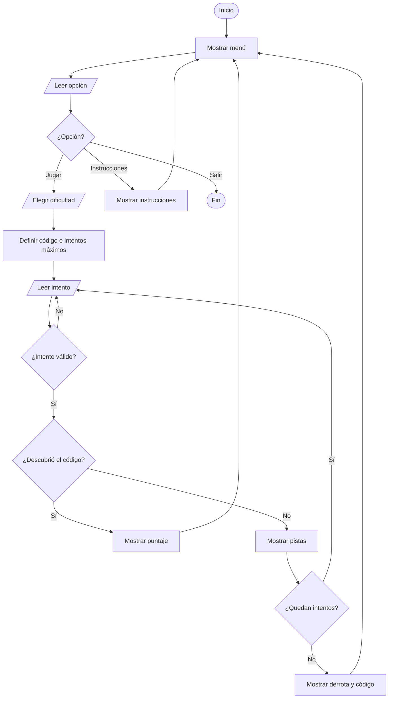

# Arquitectura del proyecto Código Secreto

## 1. Objetivo

Construir un juego de consola pequeño, comprensible y demostrable con el contenido avanzado en Introducción a la Programación.

El jugador intenta descubrir un código secreto de 3 dígitos sin repetir. Después de cada intento recibe dos pistas:

- Dígitos correctos y bien ubicados.
- Dígitos correctos, pero ubicados en otra posición.

## 2. Decisiones de alcance

La primera versión evita arrays, clases y bibliotecas adicionales. El objetivo es dominar una base funcional antes de agregar reglas avanzadas.

Por esa razón:

- El código siempre tiene 3 dígitos diferentes.
- El intento del jugador también debe tener 3 dígitos diferentes.
- Los códigos secretos se alternan con condicionales.
- No se usa generación aleatoria por ahora.
- La segunda fase de desbloqueo queda como ampliación posterior.

## 3. Relación con las lecciones

| Tema | Aplicación en el proyecto |
| :--- | :--- |
| Algoritmos y diagramas de flujo | El juego tiene inicio, entradas, procesos, decisiones y fin. |
| Condicionales | Validan opciones, dificultades, intentos y victoria. |
| Ciclo `while` | Repite el menú, valida entradas y controla la partida. |
| Ciclo `for` | Revisa exactamente las 3 posiciones del código. |
| Operador `% 10` | Extrae el último dígito de un número. |
| División `/ 10` | Elimina el último dígito ya procesado. |
| Funciones | Separan cada responsabilidad del programa. |
| Headers y sources | Organizan prototipos e implementaciones por propósito. |

La diapositiva `leccion10_modularidad.pdf` recomienda agrupar el código por propósito y separar los prototipos de las implementaciones. Esta base sigue ese criterio.

## 4. Separación por módulos

### `main.cpp`

Solo coordina el programa:

1. Muestra el menú.
2. Lee la opción.
3. Inicia una partida o muestra instrucciones.
4. Termina cuando el jugador elige salir.

### `juego.h` y `juego.cpp`

Contienen la lógica general de la experiencia:

- Menú.
- Instrucciones.
- Dificultad.
- Cantidad de intentos.
- Elección del código secreto.
- Puntaje.
- Ciclo principal de la partida.

### `logica_digitos.h` y `logica_digitos.cpp`

Contienen operaciones numéricas reutilizables:

- Verificar si un número tiene 3 dígitos.
- Verificar si un dígito existe dentro de un número.
- Detectar dígitos repetidos.
- Contar dígitos bien ubicados.
- Contar dígitos existentes, pero mal ubicados.

## 5. Flujo principal



## 6. Lógica de las pistas

Para procesar un número se repiten dos operaciones:

```cpp
digito = numero % 10;
numero = numero / 10;
```

Ejemplo con `527`:

| Paso | Operación | Dígito obtenido | Número restante |
| :--- | :--- | :--- | :--- |
| 1 | `527 % 10` | `7` | `52` |
| 2 | `52 % 10` | `2` | `5` |
| 3 | `5 % 10` | `5` | `0` |

Para contar los dígitos bien ubicados, el programa compara los dígitos extraídos del código y del intento en cada una de las 3 posiciones.

Para contar los dígitos mal ubicados:

1. Revisa cada dígito del intento.
2. Comprueba si existe dentro del código secreto.
3. Cuenta todos los dígitos existentes.
4. Resta los que ya estaban bien ubicados.

## 7. Fases de implementación

### Fase 1: base funcional

Estado: implementada.

- Menú.
- Instrucciones.
- Tres dificultades.
- Validación de opciones e intentos.
- Pistas.
- Victoria, derrota y puntaje.

### Fase 2: desbloqueo avanzado

Estado: pendiente.

Después de descubrir el código, se puede pedir una clave transformada. La ampliación más alineada con la clase del 28 de abril es intercalar dígitos pares e impares.

Conviene implementarla en archivos propios:

```text
desbloqueo.h
desbloqueo.cpp
```

Funciones sugeridas:

```cpp
void ordenarAscendente(int &numero);
void intercalarParesImparesDescendente(int &numero);
bool validarClaveFinal(int codigoDescubierto, int claveIngresada);
```

### Fase 3: mejoras opcionales

Estado: no necesaria para la entrega mínima.

- Confirmar con el profesor si permite una biblioteca para elegir códigos aleatoriamente.
- Agregar más reglas de transformación únicamente si la fase 2 ya funciona.
- Mejorar mensajes de consola sin modificar la lógica principal.

## 8. Pruebas manuales mínimas

Antes de agregar la fase 2, comprobar:

1. El menú rechaza opciones fuera del rango `1` a `3`.
2. La dificultad rechaza opciones fuera del rango `1` a `3`.
3. Un intento como `55` se rechaza porque no tiene 3 dígitos.
4. Un intento como `551` se rechaza porque repite un dígito.
5. Un intento válido muestra las dos pistas.
6. Un código correcto termina la partida y muestra el puntaje.
7. Al agotar los intentos se muestra el código secreto.
