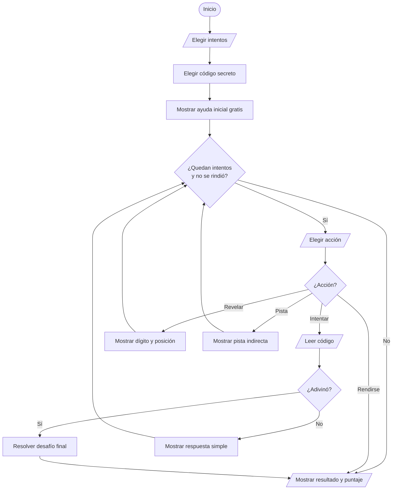

# Explicación del juego Código Secreto

## 1. Objetivo

El jugador debe descubrir un código secreto de cinco dígitos diferentes.

El juego no obliga a jugar de una sola forma. El jugador puede arriesgarse con pocos intentos o pedir ayudas. Al final recibe un puntaje según sus decisiones.

## 2. Reglas

1. El código tiene exactamente cinco dígitos diferentes.
2. El jugador elige entre `5` y `20` intentos.
3. Al iniciar recibe gratis un dígito con su posición.
4. Puede pedir hasta `2` revelaciones extra.
5. Puede pedir hasta `3` pistas indirectas.
6. Descubrir el código activa un desafío final obligatorio.
7. El jugador gana solo si completa el desafío final.

## 3. Organización de `codigo.cpp`

```text
1. Biblioteca <iostream>
2. Prototipos de funciones
3. Función main
4. Funciones que procesan dígitos
5. Funciones que interactúan con el jugador
6. Funciones que controlan la partida
```

El prototipo anuncia una función:

```cpp
int sumarDigitos(int numero);
```

La llamada ejecuta la función:

```cpp
sumarDigitos(codigoSecreto)
```

La definición contiene la lógica:

```cpp
int sumarDigitos(int numero) {
    int suma = 0;

    while (numero > 0) {
        int digito = numero % 10;
        numero = numero / 10;
        suma = suma + digito;
    }

    return suma;
}
```

## 4. Procesar dígitos sin arrays

Para extraer el último dígito:

```cpp
digito = numero % 10;
```

Para eliminar el último dígito:

```cpp
numero = numero / 10;
```

Ejemplo:

| Paso | Número antes | Dígito extraído | Número después |
| :--- | ---: | ---: | ---: |
| 1 | `58274` | `4` | `5827` |
| 2 | `5827` | `7` | `582` |
| 3 | `582` | `2` | `58` |
| 4 | `58` | `8` | `5` |
| 5 | `5` | `5` | `0` |

## 5. Funciones principales

| Función | Responsabilidad |
| :--- | :--- |
| `tieneCincoDigitos` | Comprueba que el número esté entre `10000` y `99999`. |
| `existeDigito` | Busca un dígito dentro de un número. |
| `tieneDigitosRepetidos` | Detecta repeticiones. |
| `esCodigoValido` | Exige cinco dígitos diferentes. |
| `obtenerDigitoEnPosicion` | Muestra un dígito según su posición de izquierda a derecha. |
| `contarDigitosBienUbicados` | Compara las cinco posiciones. |
| `contarDigitosMalUbicados` | Cuenta coincidencias ubicadas en otra posición. |
| `mostrarPistaIndirecta` | Muestra suma, pares/impares o mayor/menor que `50000`. |
| `calcularClaveFinal` | Intercala pares e impares de mayor a menor. |
| `calcularPuntaje` | Calcula el resultado final. |

## 6. Ejemplo de intento

Código secreto:

```text
58274
```

Intento:

```text
12345
```

Resultado:

```text
Acertaste 0 lugares exactos.
Tienes 3 digitos correctos en otro lugar.
```

Los dígitos `2`, `4` y `5` existen en el secreto, pero no están en su posición.

## 7. Pistas indirectas

| Pista | Resultado con código `58274` |
| ---: | :--- |
| `1` | La suma es `26`. |
| `2` | Tiene `3` pares y `2` impares. |
| `3` | El código completo es mayor que `50000`. |

Estas pistas ayudan, pero no entregan una posición exacta.

## 8. Desafío final

Después de descubrir el código, el jugador debe transformarlo.

Ejemplo con `58274`:

```text
Pares: 8, 4, 2
Impares: 7, 5
Clave final: 87452
```

La regla empieza por pares. Si un grupo se acaba, se agregan los dígitos restantes del otro grupo.

## 9. Puntaje

```text
puntaje = 100
puntaje = puntaje - intentos extra elegidos
puntaje = puntaje - intentos usados
puntaje = puntaje - ayudas usadas
puntaje = puntaje - errores del desafio final
```

Si el jugador no completa el juego, el puntaje es `0`.

## 10. Códigos secretos

La función `elegirCodigoSecreto` alterna cinco códigos predefinidos:

| Partida | Código |
| ---: | ---: |
| `1` | `58274` |
| `2` | `73619` |
| `3` | `49186` |
| `4` | `62735` |
| `5` | `94382` |

Después vuelve a comenzar.

## 11. Flujo de una partida



## 12. Compilar

```bash
g++ -std=c++17 -Wall -Wextra -pedantic codigo.cpp -o build/codigo_secreto
./build/codigo_secreto
```
