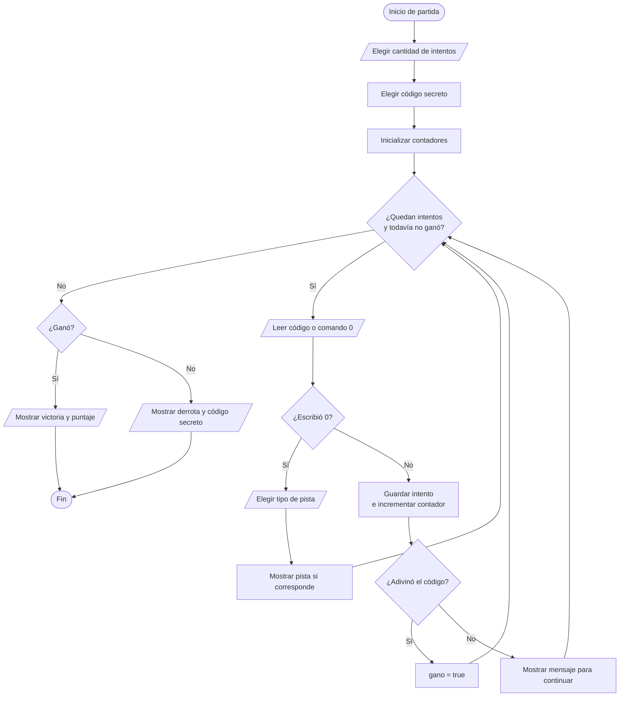

# Explicación del juego Código Secreto

## 1. Objetivo

Código Secreto es un juego de consola. El jugador debe descubrir un número oculto de tres dígitos diferentes.

Antes de comenzar, el jugador define cuántos intentos desea tener. Durante la partida puede ingresar un código o escribir `0` para abrir un menú de pistas.

El proyecto está pensado para demostrar lógica básica de Introducción a la Programación sin usar arrays ni bibliotecas adicionales.

## 2. Reglas del juego

1. El código secreto contiene exactamente tres dígitos diferentes.
2. Cada intento también debe tener tres dígitos diferentes.
3. Un código inválido no consume un intento.
4. El comando `0` abre el menú de pistas.
5. Pedir una pista no consume un intento.
6. El jugador gana cuando ingresa exactamente el código secreto.
7. El puntaje depende de cuántos intentos utilizó para ganar.

## 3. Temas de programación aplicados

| Tema | Uso dentro del proyecto |
| :--- | :--- |
| Variables | Guardan opciones, intentos, pistas y códigos. |
| `if`, `else if`, `else` | Controlan decisiones. |
| `while` | Repiten validaciones y procesos que dependen de una condición. |
| `do while` | Repite el menú principal al menos una vez. |
| `for` | Compara exactamente las tres posiciones del código. |
| `% 10` | Extrae el último dígito de un número. |
| `/ 10` | Elimina el último dígito de un número entero. |
| Funciones | Separan el programa en tareas pequeñas y entendibles. |
| `bool` | Representa respuestas de verdadero o falso. |

## 4. Organización de `codigo.cpp`

El archivo está ordenado para facilitar su lectura:

```text
1. Inclusión de <iostream>
2. Prototipos agrupados por propósito
3. Función main
4. Funciones para trabajar con dígitos
5. Funciones para interactuar con el jugador
6. Funciones para controlar pistas y partida
```

### Prototipo

Un prototipo anuncia que una función existirá:

```cpp
int sumarDigitos(int numero);
```

### Definición

La definición contiene la lógica completa:

```cpp
int sumarDigitos(int numero) {
    int suma = 0;

    while (numero > 0) {
        int digito = numero % 10;
        numero = numero / 10;
        suma = suma + digito;
    }

    return suma;
}
```

### Llamada

Una llamada ejecuta la función:

```cpp
sumarDigitos(codigoSecreto)
```

## 5. Flujo principal

La función `main`:

1. Muestra el menú.
2. Lee una opción válida.
3. Inicia una partida o muestra instrucciones.
4. Repite el menú mientras el usuario no elija salir.
5. Muestra un mensaje de despedida.

Se usa `do while` porque el menú debe aparecer al menos una vez.

## 6. Procesar dígitos sin arrays

### Extraer el último dígito

```cpp
digito = numero % 10;
```

Ejemplo:

```text
527 % 10 = 7
```

### Eliminar el último dígito

```cpp
numero = numero / 10;
```

Ejemplo usando división entera:

```text
527 / 10 = 52
```

### Recorrido completo

| Paso | Número antes | Dígito extraído | Número después |
| :--- | ---: | ---: | ---: |
| 1 | `527` | `7` | `52` |
| 2 | `52` | `2` | `5` |
| 3 | `5` | `5` | `0` |

## 7. Funciones para trabajar con dígitos

| Función | Responsabilidad |
| :--- | :--- |
| `tieneTresDigitos` | Comprueba que el número esté entre `100` y `999`. |
| `existeDigito` | Busca un dígito dentro de un número. |
| `tieneDigitosRepetidos` | Detecta si un dígito aparece más de una vez. |
| `esCodigoValido` | Exige tres dígitos diferentes. |
| `contarDigitosBienUbicados` | Cuenta coincidencias de valor y posición. |
| `contarDigitosMalUbicados` | Cuenta coincidencias que están en otra posición. |
| `contarDigitosPares` | Cuenta cuántos dígitos son divisibles entre `2`. |
| `sumarDigitos` | Suma todos los dígitos de un número. |

### Ejemplo de repetición

Para validar `551`:

1. Extrae `1` y lo busca dentro de `55`.
2. Extrae `5` y lo busca dentro de `5`.
3. Encuentra otro `5`.
4. Retorna `true`: el código tiene dígitos repetidos.

### Ejemplo de posiciones

Código secreto:

```text
527
```

Intento:

```text
572
```

| Posición | Secreto | Intento | Resultado |
| :--- | ---: | ---: | :--- |
| Centenas | `5` | `5` | Bien ubicado. |
| Decenas | `2` | `7` | Mal ubicado. |
| Unidades | `7` | `2` | Mal ubicado. |

Resultado:

```text
Bien ubicados: 1
Mal ubicados: 2
```

## 8. Funciones para interactuar con el jugador

| Función | Responsabilidad |
| :--- | :--- |
| `leerEntero` | Lee números y se recupera si el usuario escribe texto. |
| `mostrarMenuPrincipal` | Muestra jugar, instrucciones y salir. |
| `pedirOpcionMenuPrincipal` | Acepta únicamente opciones entre `1` y `3`. |
| `mostrarInstrucciones` | Explica cómo jugar. |
| `pedirCantidadIntentos` | Permite elegir entre `1` y `20` intentos. |
| `pedirCodigoOComando` | Acepta un código válido o el comando `0`. |
| `mostrarErrorCodigo` | Explica por qué un código fue rechazado. |
| `mostrarEstadoPartida` | Informa intentos restantes, pistas usadas y comando disponible. |

## 9. Códigos secretos predefinidos

La función `elegirCodigoSecreto` alterna cinco posibilidades:

| Número de partida | Selector `numeroPartida % 5` | Código |
| ---: | ---: | ---: |
| `1` | `1` | `527` |
| `2` | `2` | `731` |
| `3` | `3` | `864` |
| `4` | `4` | `392` |
| `5` | `0` | `615` |

Después comienza nuevamente el ciclo.

Esta estrategia evita bibliotecas adicionales y sigue siendo suficiente para una demostración académica.

## 10. Menú de pistas

El jugador escribe `0` durante cualquier turno.

| Opción | Resultado | ¿Necesita un intento previo? |
| ---: | :--- | :--- |
| `1` | Cantidad de dígitos bien ubicados. | Sí |
| `2` | Cantidad de dígitos correctos en otra posición. | Sí |
| `3` | Cantidad de dígitos pares del código secreto. | No |
| `4` | Suma de los dígitos del código secreto. | No |
| `5` | Informa si el código secreto es mayor o menor que `500`. | No |
| `6` | Regresa sin mostrar pista. | No |

La función `mostrarPista` devuelve un valor `bool`:

- `true`: mostró una pista y debe incrementar el contador.
- `false`: no mostró una pista útil.

## 11. Puntaje

```cpp
puntaje = 1100 - intentosUsados * 100;
```

El puntaje depende solamente de los intentos usados. Elegir más intentos al configurar la partida no aumenta artificialmente el puntaje.

Si el resultado es negativo, se reemplaza por `0`.

## 12. Flujo de una partida



## 13. Pseudocódigo resumido

```text
PROCEDIMIENTO jugar(numeroPartida)
    cantidadIntentos = pedir cantidad de intentos
    codigoSecreto = elegir código secreto
    intentosUsados = 0
    pistasUsadas = 0
    ultimoIntento = 0
    gano = falso

    MIENTRAS quedan intentos Y no ganó
        mostrar estado
        codigoOComando = pedir código o comando

        SI codigoOComando == 0 ENTONCES
            pedir tipo de pista
            mostrar pista si corresponde
        SINO
            guardar último intento
            incrementar intentos usados

            SI adivinó el código ENTONCES
                gano = verdadero
            SINO
                invitar a intentar nuevamente o pedir una pista
            FIN SI
        FIN SI
    FIN MIENTRAS

    mostrar victoria o derrota
FIN PROCEDIMIENTO
```

## 14. Compilar y ejecutar

```bash
mkdir -p build
g++ -std=c++17 -Wall -Wextra -pedantic codigo.cpp -o build/codigo_secreto
./build/codigo_secreto
```
