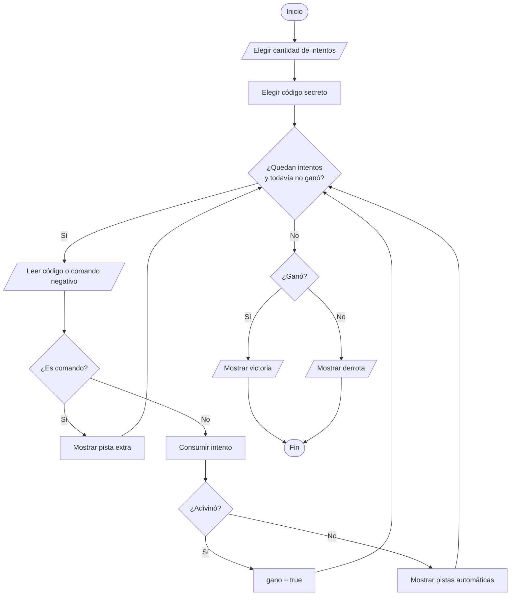

# Explicación del juego Código Secreto

## 1. Objetivo

El jugador debe descubrir un código secreto de tres dígitos diferentes.

Después de cada intento incorrecto, el programa muestra:

- Cuántos dígitos son correctos y están bien ubicados.
- Cuántos dígitos son correctos, pero están en otra posición.

Si necesita ayuda adicional, el jugador puede usar `-1`, `-2` o `-3`.

## 2. Reglas

1. El código tiene exactamente tres dígitos diferentes.
2. El jugador elige cuántos intentos quiere tener.
3. Un código inválido no consume intentos.
4. Un comando de pista extra tampoco consume intentos.
5. El jugador gana al ingresar exactamente el código secreto.

## 3. Organización de `codigo.cpp`

```text
1. Biblioteca <iostream>
2. Prototipos de funciones
3. Función main
4. Funciones que procesan dígitos
5. Funciones que interactúan con el jugador
6. Funciones que controlan la partida
```

El prototipo anuncia una función:

```cpp
int sumarDigitos(int numero);
```

La llamada ejecuta la función:

```cpp
sumarDigitos(codigoSecreto)
```

La definición contiene su lógica:

```cpp
int sumarDigitos(int numero) {
    int suma = 0;

    while (numero > 0) {
        int digito = numero % 10;
        numero = numero / 10;
        suma = suma + digito;
    }

    return suma;
}
```

## 4. Procesar dígitos sin arrays

Para extraer el último dígito:

```cpp
digito = numero % 10;
```

Para eliminar el último dígito:

```cpp
numero = numero / 10;
```

Ejemplo:

| Paso | Número antes | Dígito extraído | Número después |
| :--- | ---: | ---: | ---: |
| 1 | `527` | `7` | `52` |
| 2 | `52` | `2` | `5` |
| 3 | `5` | `5` | `0` |

## 5. Funciones de dígitos

| Función | Responsabilidad |
| :--- | :--- |
| `tieneTresDigitos` | Comprueba que el número esté entre `100` y `999`. |
| `existeDigito` | Busca un dígito dentro de un número. |
| `tieneDigitosRepetidos` | Detecta repeticiones. |
| `esCodigoValido` | Exige exactamente tres dígitos diferentes. |
| `contarDigitosBienUbicados` | Compara las tres posiciones. |
| `contarDigitosMalUbicados` | Cuenta coincidencias ubicadas en otra posición. |
| `contarDigitosPares` | Cuenta dígitos divisibles entre `2`. |
| `sumarDigitos` | Suma todos los dígitos. |

## 6. Ejemplo de las pistas automáticas

Código secreto:

```text
527
```

Intento:

```text
572
```

Resultado:

```text
Bien ubicados: 1
Correctos en otra posicion: 2
```

El `5` está bien ubicado. El `7` y el `2` existen, pero están intercambiados.

## 7. Pistas extra

| Comando | Resultado con código `527` |
| ---: | :--- |
| `-1` | La suma es `14`. |
| `-2` | Existe `1` dígito par. |
| `-3` | El código es mayor que `500`. |

Los comandos negativos no pueden confundirse con un código válido.

## 8. Elegir códigos secretos

La función `elegirCodigoSecreto` alterna cinco códigos predefinidos:

| Partida | Código |
| ---: | ---: |
| `1` | `527` |
| `2` | `731` |
| `3` | `864` |
| `4` | `392` |
| `5` | `615` |

Después vuelve a comenzar.

## 9. Flujo de una partida



## 10. Ciclos usados

| Ciclo | Uso |
| :--- | :--- |
| `do while` | Mostrar el menú principal al menos una vez. |
| `while` | Repetir la partida y recorrer dígitos. |
| `for` | Comparar exactamente tres posiciones. |

## 11. Compilar

```bash
g++ -std=c++17 -Wall -Wextra -pedantic codigo.cpp -o build/codigo_secreto
./build/codigo_secreto
```
