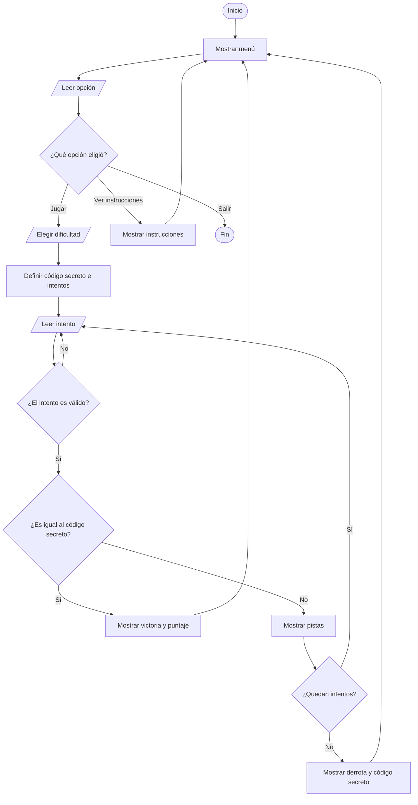

# Explicación del juego Código Secreto

## 1. Objetivo

El programa es un juego de consola. El jugador debe descubrir un código secreto de 3 dígitos diferentes.

Después de cada intento incorrecto, el juego muestra dos pistas:

- Cuántos dígitos son correctos y están en la posición correcta.
- Cuántos dígitos existen en el código, pero están en otra posición.

El código completo está en `codigo.cpp` porque la entrega debe usar un solo archivo fuente.

## 2. Reglas respetadas

El ejercicio usa lógica básica de Introducción a la Programación:

- Condicionales `if`, `else if` y `else`.
- Bucles `while`, `do while` y `for`.
- Funciones para separar responsabilidades dentro del mismo archivo.
- Operaciones matemáticas `% 10` y `/ 10` para revisar dígitos.
- Únicamente la biblioteca `<iostream>` para leer y mostrar datos.

No se usan arrays, clases ni bibliotecas adicionales.

## 3. Organización de `codigo.cpp`

Aunque todo el juego está en un solo archivo, las funciones mantienen el código ordenado.

| Grupo | Funciones principales | Responsabilidad |
| :--- | :--- | :--- |
| Validación de dígitos | `tieneTresDigitos`, `existeDigito`, `tieneDigitosRepetidos`, `esIntentoValido` | Comprueban que cada intento cumpla las reglas. |
| Cálculo de pistas | `contarDigitosBienUbicados`, `contarDigitosMalUbicados` | Comparan el intento con el código secreto. |
| Entrada y menú | `leerEntero`, `mostrarMenu`, `pedirOpcionMenu`, `mostrarInstrucciones` | Permiten interactuar con el jugador. |
| Partida | `pedirDificultad`, `obtenerCantidadIntentos`, `elegirCodigoSecreto`, `pedirIntento`, `calcularPuntaje`, `jugar` | Controlan una partida completa. |
| Inicio | `main` | Repite el menú hasta que el jugador elige salir. |

## 4. Cómo se revisan los dígitos

Para extraer el último dígito de un número se usa:

```cpp
digito = numero % 10;
```

Para eliminar el último dígito ya revisado se usa:

```cpp
numero = numero / 10;
```

Por ejemplo, con el número `527`:

| Paso | Operación | Dígito obtenido | Número restante |
| :--- | :--- | :--- | :--- |
| 1 | `527 % 10` | `7` | `52` |
| 2 | `52 % 10` | `2` | `5` |
| 3 | `5 % 10` | `5` | `0` |

El programa repite estas operaciones con bucles. Así puede revisar cada dígito sin usar arrays.

## 5. Cómo se calculan las pistas

### Dígitos bien ubicados

La función `contarDigitosBienUbicados` compara el último dígito del código secreto con el último dígito del intento. Después elimina ambos dígitos y repite el proceso 3 veces.

### Dígitos mal ubicados

La función `contarDigitosMalUbicados` revisa cada dígito del intento y cuenta cuántos existen dentro del código secreto. Luego resta los dígitos que ya estaban bien ubicados.

Ejemplo:

```text
Código secreto: 527
Intento:        572
```

- El `5` está bien ubicado.
- El `7` existe, pero está mal ubicado.
- El `2` existe, pero está mal ubicado.

Resultado:

```text
Dígitos correctos y bien ubicados: 1
Dígitos correctos pero mal ubicados: 2
```

## 6. Flujo principal



## 7. Compilar y ejecutar

Desde la carpeta del proyecto:

```bash
mkdir -p build
g++ -std=c++17 -Wall -Wextra -pedantic codigo.cpp -o build/codigo_secreto
./build/codigo_secreto
```

## 8. Pruebas manuales mínimas

1. Elegir `3` en el menú y comprobar que el programa termina.
2. Escribir una opción fuera del rango `1` a `3` y comprobar que se rechaza.
3. Escribir letras cuando se espera un número y comprobar que se solicita otro valor.
4. Intentar jugar con `55` y comprobar que se rechaza por no tener 3 dígitos.
5. Intentar jugar con `551` y comprobar que se rechaza por repetir un dígito.
6. Ingresar un código válido incorrecto y revisar las dos pistas.
7. Ingresar el código correcto y comprobar que se muestra el puntaje.
