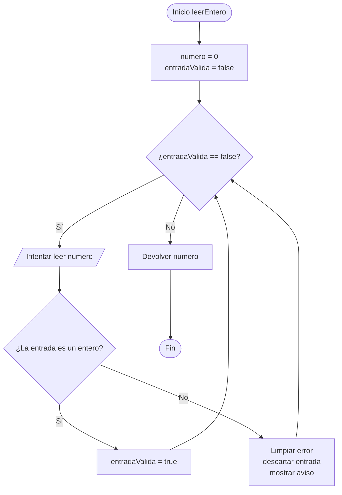
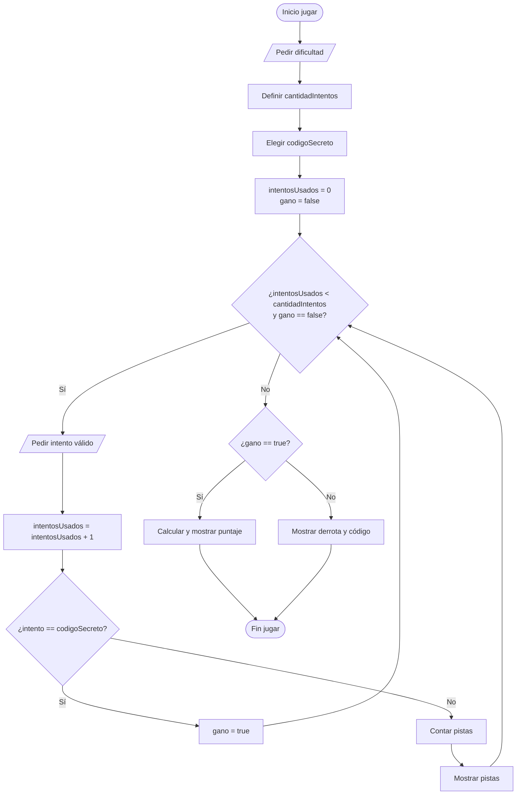

# Explicación de `juego.h` y `juego.cpp`

## 1. Propósito del módulo

El módulo `juego` controla la experiencia completa de una partida:

- Lectura de números enteros.
- Menú principal.
- Instrucciones.
- Selección de dificultad.
- Cantidad de intentos.
- Elección del código secreto.
- Lectura y validación de intentos.
- Cálculo del puntaje.
- Ciclo de victoria o derrota.

Se divide en dos archivos:

| Archivo | Responsabilidad |
| :--- | :--- |
| `juego.h` | Declara los prototipos disponibles. |
| `juego.cpp` | Implementa el comportamiento de cada función. |

## 2. Header `juego.h`

### Protección contra inclusiones repetidas

```cpp
#ifndef JUEGO_H
#define JUEGO_H
```

y al final:

```cpp
#endif
```

Estas instrucciones forman una protección del header.

La idea es:

1. Preguntar si `JUEGO_H` todavía no está definido.
2. Definirlo la primera vez que se incluye el archivo.
3. Ignorar el contenido si otro archivo intenta incluirlo nuevamente.

Esto evita declarar dos veces los mismos prototipos durante la compilación.

### Prototipos

```cpp
void mostrarMenu();
int leerEntero();
int pedirOpcionMenu();
void mostrarInstrucciones();
int pedirDificultad();
int obtenerCantidadIntentos(int dificultad);
int elegirCodigoSecreto(int dificultad, int numeroPartida);
int pedirIntento();
int calcularPuntaje(int intentosRestantes, int dificultad);
void jugar(int numeroPartida);
```

Un prototipo indica:

- El tipo de dato que devuelve la función.
- El nombre de la función.
- Los parámetros necesarios.

Ejemplo:

```cpp
int calcularPuntaje(int intentosRestantes, int dificultad);
```

Esta declaración informa que:

1. La función devuelve un entero.
2. Su nombre es `calcularPuntaje`.
3. Necesita dos enteros para trabajar.

## 3. Inclusiones en `juego.cpp`

```cpp
#include <iostream>

#include "juego.h"
#include "logica_digitos.h"
```

### `<iostream>`

Permite usar:

```cpp
cout
cin
```

`cout` muestra información en consola y `cin` recibe información escrita por el jugador.

### `"juego.h"`

Conecta la implementación con sus propios prototipos.

### `"logica_digitos.h"`

Permite usar operaciones numéricas implementadas en otro módulo, por ejemplo:

```cpp
esIntentoValido(intento);
contarDigitosBienUbicados(codigoSecreto, intento);
contarDigitosMalUbicados(codigoSecreto, intento);
```

### Espacio de nombres

```cpp
using namespace std;
```

Permite escribir:

```cpp
cout
cin
```

en lugar de:

```cpp
std::cout
std::cin
```

## 4. Función `leerEntero`

```cpp
int leerEntero() {
```

Centraliza la lectura de números enteros. Así no es necesario repetir la misma validación en cada menú.

### Variables

```cpp
int numero = 0;
bool entradaValida = false;
```

`numero` almacena el valor ingresado. `entradaValida` funciona como interruptor lógico:

| Valor | Significado |
| :--- | :--- |
| `false` | Todavía no existe un entero válido. |
| `true` | Ya se recibió un entero y el ciclo puede terminar. |

### Validación

```cpp
while (entradaValida == false) {
    if (cin >> numero) {
        entradaValida = true;
    } else {
        cin.clear();
        cin.ignore(1000, '\n');
        cout << "Entrada invalida. Ingrese un numero entero: ";
    }
}
```

Si el usuario escribe un entero, `cin >> numero` funciona y la variable cambia a `true`.

Si escribe texto:

```cpp
cin.clear();
```

limpia el estado de error.

Después:

```cpp
cin.ignore(1000, '\n');
```

descarta los caracteres incorrectos hasta llegar al salto de línea.

### Diagrama



## 5. Menú principal

### `mostrarMenu`

```cpp
void mostrarMenu() {
```

El tipo `void` significa que la función realiza una acción, pero no devuelve un resultado.

Su única responsabilidad es mostrar:

```text
=== CODIGO SECRETO ===
1. Jugar
2. Ver instrucciones
3. Salir
```

### `pedirOpcionMenu`

```cpp
int pedirOpcionMenu() {
```

Lee un entero mediante:

```cpp
opcion = leerEntero();
```

Después valida el rango:

```cpp
while (opcion < 1 || opcion > 3) {
```

El operador `||` significa `OR`. La opción es inválida si ocurre al menos una condición:

- Es menor que `1`.
- Es mayor que `3`.

Cuando la opción entra en el rango permitido, la función la devuelve:

```cpp
return opcion;
```

## 6. Instrucciones

```cpp
void mostrarInstrucciones() {
```

Muestra las reglas esenciales:

- El código tiene 3 dígitos.
- Los dígitos no se repiten.
- Existen pistas para posiciones correctas y posiciones incorrectas.

Se mantiene separada porque mostrar texto es una responsabilidad distinta de procesar la partida.

## 7. Dificultad

### `pedirDificultad`

Muestra tres alternativas:

| Dificultad | Valor | Intentos |
| :--- | :--- | :--- |
| Fácil | `1` | `10` |
| Normal | `2` | `7` |
| Difícil | `3` | `5` |

Valida el rango con la misma lógica del menú:

```cpp
while (dificultad < 1 || dificultad > 3) {
```

### `obtenerCantidadIntentos`

```cpp
int obtenerCantidadIntentos(int dificultad) {
```

Transforma el número de dificultad en una cantidad de intentos:

```cpp
if (dificultad == 1) {
    cantidadIntentos = 10;
} else if (dificultad == 2) {
    cantidadIntentos = 7;
} else {
    cantidadIntentos = 5;
}
```

La función separa una regla de negocio concreta: decidir cuántas oportunidades tendrá el jugador.

## 8. Elección del código secreto

```cpp
int elegirCodigoSecreto(int dificultad, int numeroPartida) {
```

La función alterna entre cinco códigos válidos sin usar arrays ni bibliotecas adicionales.

### Selector

```cpp
int selector = (dificultad + numeroPartida) % 5;
```

El operador `%` obtiene el residuo. Al dividir entre `5`, los únicos residuos posibles son:

```text
0, 1, 2, 3, 4
```

Cada residuo corresponde a un código:

| Selector | Código secreto |
| :--- | :--- |
| `0` | `527` |
| `1` | `731` |
| `2` | `864` |
| `3` | `392` |
| `4` | `615` |

La suma de dificultad y número de partida permite variar el resultado de manera controlada.

### Por qué no se usa aleatoriedad todavía

Una selección aleatoria normalmente requiere bibliotecas adicionales. El proyecto mantiene una base compatible con la regla local: lógica pura, bucles y recursos vistos en clase.

## 9. Lectura de intentos

```cpp
int pedirIntento() {
```

Lee un código mediante:

```cpp
intento = leerEntero();
```

Después llama al módulo numérico:

```cpp
while (esIntentoValido(intento) == false) {
```

La validación continúa mientras el intento:

- No tenga exactamente 3 dígitos.
- Tenga algún dígito repetido.

## 10. Puntaje

```cpp
int calcularPuntaje(int intentosRestantes, int dificultad) {
    return dificultad * 100 + intentosRestantes * 50;
}
```

El puntaje premia dos aspectos:

| Parte | Propósito |
| :--- | :--- |
| `dificultad * 100` | Jugar en un nivel más difícil entrega una base mayor. |
| `intentosRestantes * 50` | Resolver el código rápidamente entrega más puntos. |

Ejemplo:

```text
dificultad = 2
intentosRestantes = 5
puntaje = 2 * 100 + 5 * 50
puntaje = 450
```

## 11. Ciclo principal `jugar`

```cpp
void jugar(int numeroPartida) {
```

Esta función reúne las reglas de una partida sin mezclar las responsabilidades internas de los otros procedimientos.

### Preparación

```cpp
int dificultad = pedirDificultad();
int cantidadIntentos = obtenerCantidadIntentos(dificultad);
int codigoSecreto = elegirCodigoSecreto(dificultad, numeroPartida);
int intentosUsados = 0;
bool gano = false;
```

| Variable | Propósito |
| :--- | :--- |
| `dificultad` | Nivel seleccionado. |
| `cantidadIntentos` | Límite máximo de oportunidades. |
| `codigoSecreto` | Número oculto que se debe descubrir. |
| `intentosUsados` | Cantidad de intentos consumidos. |
| `gano` | Indica si la partida ya terminó con victoria. |

### Condición de repetición

```cpp
while (intentosUsados < cantidadIntentos && gano == false) {
```

El operador `&&` significa `AND`. El ciclo continúa únicamente si ambas condiciones siguen siendo verdaderas:

1. Todavía quedan intentos.
2. El jugador todavía no ganó.

### Procesamiento de cada intento

```cpp
intento = pedirIntento();
intentosUsados++;
```

Si el intento coincide exactamente:

```cpp
if (intento == codigoSecreto) {
    gano = true;
}
```

Si no coincide, se muestran pistas:

```cpp
bienUbicados = contarDigitosBienUbicados(codigoSecreto, intento);
malUbicados = contarDigitosMalUbicados(codigoSecreto, intento);
```

### Resultado final

Después del ciclo existen dos caminos:

```cpp
if (gano == true) {
```

calcula el puntaje y muestra la victoria.

El camino contrario:

```cpp
else {
```

muestra la derrota y revela el código secreto.

## 12. Diagrama de la partida



## 13. Ejemplo de recorrido

Supongamos:

```text
dificultad = 2
numeroPartida = 1
```

El selector es:

```text
(2 + 1) % 5 = 3
```

Por tanto:

```text
codigoSecreto = 392
```

Si el jugador ingresa:

```text
293
```

recibe:

```text
Digitos correctos y bien ubicados: 1
Digitos correctos pero mal ubicados: 2
```

Después puede ingresar:

```text
392
```

y terminar la partida.

## 14. Justificación

El módulo concentra las reglas de interacción y delega la manipulación numérica a `logica_digitos.cpp`.

Esto permite:

- Modificar mensajes sin alterar el algoritmo de pistas.
- Cambiar el puntaje en una sola función.
- Añadir una fase de desbloqueo después de la victoria.
- Mantener `main.cpp` corto y fácil de leer.
