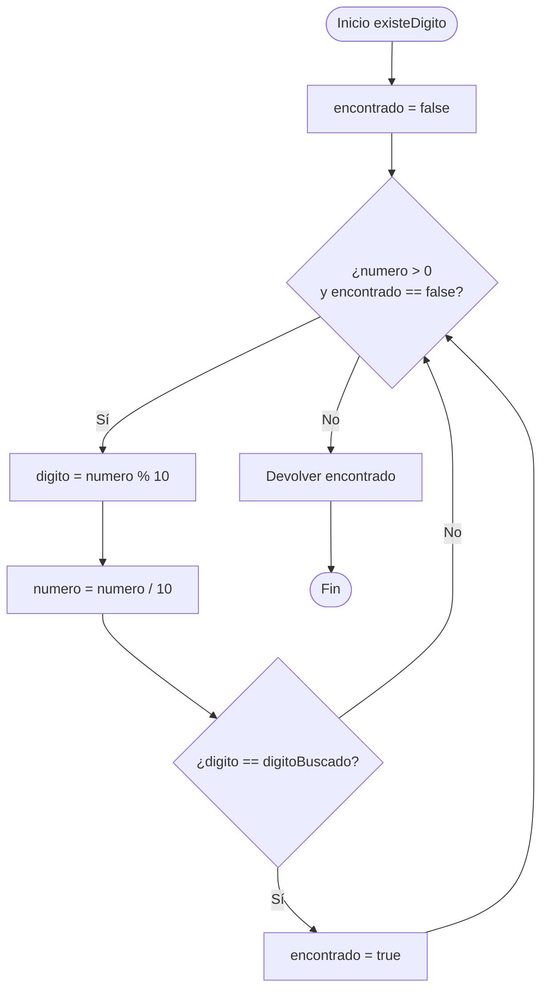
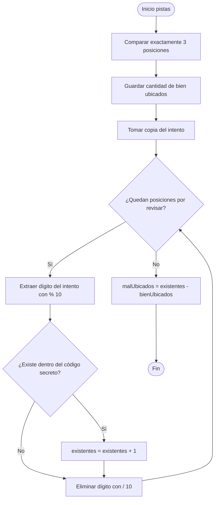

# Explicación de `logica_digitos.h` y `logica_digitos.cpp`

## 1. Propósito del módulo

El módulo `logica_digitos` concentra las operaciones matemáticas reutilizables del juego.

Su idea central viene de los ejercicios de números enteros:

```cpp
digito = numero % 10;
numero = numero / 10;
```

Estas operaciones permiten procesar un número dígito por dígito sin arrays.

| Operación | Resultado |
| :--- | :--- |
| `numero % 10` | Extrae el último dígito. |
| `numero / 10` | Elimina el último dígito mediante división entera. |

## 2. Header `logica_digitos.h`

### Protección del header

```cpp
#ifndef LOGICA_DIGITOS_H
#define LOGICA_DIGITOS_H
```

y al final:

```cpp
#endif
```

La protección evita que los prototipos se procesen repetidamente si el header se incluye desde varios archivos.

### Prototipos

```cpp
bool tieneTresDigitos(int numero);
bool existeDigito(int numero, int digitoBuscado);
bool tieneDigitosRepetidos(int numero);
bool esIntentoValido(int numero);
int contarDigitosBienUbicados(int codigoSecreto, int intento);
int contarDigitosMalUbicados(int codigoSecreto, int intento);
```

Las funciones se pueden dividir en dos grupos:

| Grupo | Funciones |
| :--- | :--- |
| Validación | `tieneTresDigitos`, `existeDigito`, `tieneDigitosRepetidos`, `esIntentoValido` |
| Pistas | `contarDigitosBienUbicados`, `contarDigitosMalUbicados` |

## 3. Inclusión en `logica_digitos.cpp`

```cpp
#include "logica_digitos.h"
```

Este módulo no necesita `<iostream>` porque no lee ni muestra mensajes. Solamente recibe valores, realiza cálculos y devuelve resultados.

Esto es una ventaja de la modularidad: la lógica numérica no depende de la consola.

## 4. Función `tieneTresDigitos`

```cpp
bool tieneTresDigitos(int numero) {
    return numero >= 100 && numero <= 999;
}
```

Devuelve un booleano:

| Resultado | Significado |
| :--- | :--- |
| `true` | El número está entre `100` y `999`. |
| `false` | El número tiene menos o más de 3 dígitos. |

El operador `&&` significa `AND`. Ambas comparaciones deben cumplirse.

Ejemplos:

| Número | Evaluación | Resultado |
| :--- | :--- | :--- |
| `55` | No cumple `numero >= 100` | `false` |
| `392` | Cumple ambas condiciones | `true` |
| `1200` | No cumple `numero <= 999` | `false` |

## 5. Función `existeDigito`

```cpp
bool existeDigito(int numero, int digitoBuscado) {
```

Busca un dígito dentro de un número.

### Variables

```cpp
bool encontrado = false;
```

Antes de revisar el número se asume que el dígito todavía no fue encontrado.

### Ciclo

```cpp
while (numero > 0 && encontrado == false) {
```

El ciclo continúa mientras:

1. Todavía queden dígitos por revisar.
2. El dígito todavía no haya sido encontrado.

### Extracción

```cpp
int digito = numero % 10;
numero = numero / 10;
```

Ejemplo: buscar `9` dentro de `392`.

| Paso | Número actual | Dígito extraído | Número restante | ¿Es `9`? |
| :--- | :--- | :--- | :--- | :--- |
| 1 | `392` | `2` | `39` | No |
| 2 | `39` | `9` | `3` | Sí |

Cuando encuentra el valor:

```cpp
encontrado = true;
```

el ciclo deja de continuar. No necesita revisar dígitos innecesarios.

### Diagrama



## 6. Función `tieneDigitosRepetidos`

```cpp
bool tieneDigitosRepetidos(int numero) {
```

Determina si algún dígito aparece más de una vez.

### Estrategia

Para cada dígito:

1. Extraerlo con `% 10`.
2. Eliminarlo del número con `/ 10`.
3. Buscar si todavía existe dentro de los dígitos restantes.

```cpp
while (numero > 0 && tieneRepetidos == false) {
    int digito = numero % 10;
    numero = numero / 10;

    if (existeDigito(numero, digito)) {
        tieneRepetidos = true;
    }
}
```

Ejemplo con `331`:

| Paso | Número inicial | Dígito extraído | Número restante | ¿Existe en el restante? |
| :--- | :--- | :--- | :--- | :--- |
| 1 | `331` | `1` | `33` | No |
| 2 | `33` | `3` | `3` | Sí |

El resultado es `true`.

Ejemplo con `392`:

| Paso | Dígito extraído | Número restante | ¿Existe en el restante? |
| :--- | :--- | :--- | :--- |
| 1 | `2` | `39` | No |
| 2 | `9` | `3` | No |
| 3 | `3` | `0` | No |

El resultado es `false`.

## 7. Función `esIntentoValido`

```cpp
bool esIntentoValido(int numero) {
    return tieneTresDigitos(numero) && tieneDigitosRepetidos(numero) == false;
}
```

Combina dos reglas:

1. El intento debe tener exactamente 3 dígitos.
2. Ningún dígito puede repetirse.

| Intento | ¿3 dígitos? | ¿Tiene repetidos? | Resultado |
| :--- | :--- | :--- | :--- |
| `55` | No | Sí | Inválido |
| `331` | Sí | Sí | Inválido |
| `392` | Sí | No | Válido |
| `102` | Sí | No | Válido |

## 8. Función `contarDigitosBienUbicados`

```cpp
int contarDigitosBienUbicados(int codigoSecreto, int intento) {
```

Cuenta cuántos dígitos coinciden en valor y posición.

### Contador

```cpp
int bienUbicados = 0;
```

El contador comienza en cero porque todavía no se comparó ninguna posición.

### Ciclo `for`

```cpp
for (int posicion = 1; posicion <= 3; posicion++) {
```

Se usa `for` porque se conoce exactamente la cantidad de repeticiones: siempre existen 3 posiciones.

### Comparación

```cpp
int digitoSecreto = codigoSecreto % 10;
int digitoIntento = intento % 10;

if (digitoSecreto == digitoIntento) {
    bienUbicados++;
}
```

Después se eliminan los dígitos ya procesados:

```cpp
codigoSecreto = codigoSecreto / 10;
intento = intento / 10;
```

Ejemplo: código `392`, intento `293`.

| Posición procesada desde la derecha | Dígito secreto | Dígito del intento | ¿Coinciden? |
| :--- | :--- | :--- | :--- |
| 1 | `2` | `3` | No |
| 2 | `9` | `9` | Sí |
| 3 | `3` | `2` | No |

Resultado:

```text
bienUbicados = 1
```

## 9. Función `contarDigitosMalUbicados`

```cpp
int contarDigitosMalUbicados(int codigoSecreto, int intento) {
```

Cuenta los dígitos que existen dentro del código, pero están en una posición incorrecta.

### Paso 1: contar posiciones correctas

```cpp
int bienUbicados = contarDigitosBienUbicados(codigoSecreto, intento);
```

Este valor se guarda antes de consumir la copia local de `intento`.

### Paso 2: contar todos los dígitos existentes

```cpp
for (int posicion = 1; posicion <= 3; posicion++) {
    int digito = intento % 10;

    if (existeDigito(codigoSecreto, digito)) {
        existentes++;
    }

    intento = intento / 10;
}
```

### Paso 3: restar los bien ubicados

```cpp
return existentes - bienUbicados;
```

La resta es necesaria porque un dígito bien ubicado también existe dentro del código, pero no debe contarse dos veces.

Ejemplo: código `392`, intento `293`.

| Dígito del intento | ¿Existe en `392`? |
| :--- | :--- |
| `3` | Sí |
| `9` | Sí |
| `2` | Sí |

Entonces:

```text
existentes = 3
bienUbicados = 1
malUbicados = existentes - bienUbicados
malUbicados = 3 - 1
malUbicados = 2
```

## 10. Diagrama general de las pistas



## 11. Paso por valor

Funciones como:

```cpp
bool existeDigito(int numero, int digitoBuscado);
```

reciben valores por copia. Por eso pueden ejecutar:

```cpp
numero = numero / 10;
```

sin destruir el número original guardado en `juego.cpp`.

Este detalle es importante: el módulo puede consumir copias numéricas para analizarlas y el código secreto real continúa disponible durante toda la partida.

## 12. Justificación

Este módulo demuestra la lógica central del curso:

- Variables.
- Booleanos.
- Condicionales.
- Ciclos `while`.
- Ciclos `for`.
- Operadores `&&`.
- Operador `%`.
- División entera.
- Contadores.
- Funciones que reutilizan otras funciones.

No usa arrays ni bibliotecas adicionales. Toda la lógica se resuelve manipulando números enteros.
