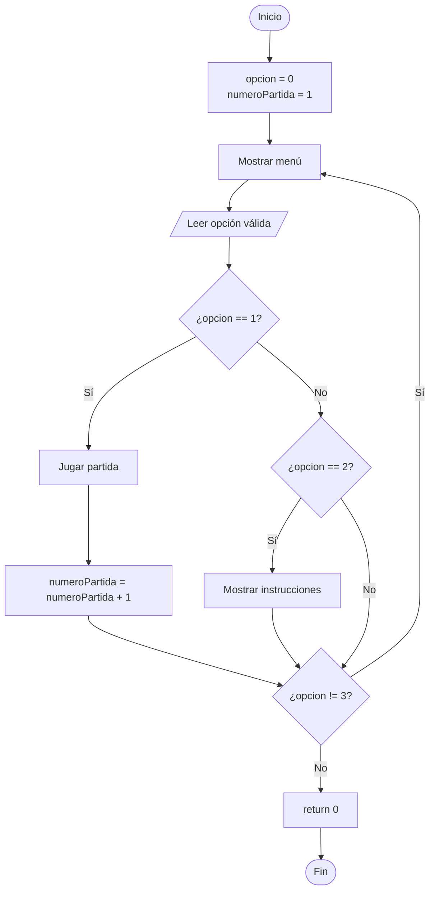

# Explicación de `main.cpp`

## 1. Propósito del archivo

`main.cpp` es el punto de entrada del programa. Su función no es resolver toda la lógica del juego, sino coordinar el flujo principal:

1. Mostrar el menú.
2. Leer la opción elegida.
3. Iniciar una partida o mostrar las instrucciones.
4. Repetir el menú hasta que el jugador decida salir.

Esta separación aplica la modularidad explicada en clase: cada archivo debe tener un propósito claro. Los detalles de la partida están en `juego.cpp` y las operaciones con dígitos están en `logica_digitos.cpp`.

## 2. Inclusión del módulo de juego

```cpp
#include "juego.h"
```

`main.cpp` necesita llamar a funciones como:

```cpp
mostrarMenu();
pedirOpcionMenu();
jugar(numeroPartida);
mostrarInstrucciones();
```

Sus prototipos están declarados en `juego.h`. El header funciona como una tabla de contenido: permite saber qué funciones ofrece el módulo sin copiar su implementación dentro de `main.cpp`.

## 3. Función `main`

```cpp
int main() {
```

Todo programa C++ comienza su ejecución en `main`. El tipo `int` indica que al finalizar devolverá un número al sistema operativo.

Al final se utiliza:

```cpp
return 0;
```

El valor `0` indica que el programa terminó correctamente.

## 4. Variables principales

```cpp
int opcion = 0;
int numeroPartida = 1;
```

### `opcion`

Guarda la alternativa seleccionada en el menú:

| Valor | Acción |
| :--- | :--- |
| `1` | Jugar |
| `2` | Ver instrucciones |
| `3` | Salir |

Se inicializa en `0` porque todavía no existe una elección válida antes de mostrar el menú.

### `numeroPartida`

Cuenta cuántas partidas se iniciaron durante una ejecución del programa. Comienza en `1`.

Se envía a:

```cpp
jugar(numeroPartida);
```

El módulo de juego usa este valor junto con la dificultad para alternar entre códigos secretos predefinidos. Así se evita depender de arrays o bibliotecas de generación aleatoria que todavía no forman parte del alcance permitido.

## 5. Ciclo `do while`

```cpp
do {
    mostrarMenu();
    opcion = pedirOpcionMenu();

    if (opcion == 1) {
        jugar(numeroPartida);
        numeroPartida++;
    } else if (opcion == 2) {
        mostrarInstrucciones();
    }
} while (opcion != 3);
```

Se usa `do while` porque el menú debe mostrarse al menos una vez.

La diferencia principal frente a un `while` común es:

| Ciclo | Momento en que evalúa la condición |
| :--- | :--- |
| `while` | Antes de ejecutar el bloque |
| `do while` | Después de ejecutar el bloque |

La condición:

```cpp
opcion != 3
```

significa: repetir mientras la opción sea diferente de salir.

## 6. Decisiones con `if`

### Iniciar una partida

```cpp
if (opcion == 1) {
    jugar(numeroPartida);
    numeroPartida++;
}
```

Cuando el jugador elige `1`:

1. Se llama a `jugar`.
2. Se envía el número actual de partida.
3. Al terminar, se incrementa el contador con `numeroPartida++`.

La expresión:

```cpp
numeroPartida++;
```

es equivalente a:

```cpp
numeroPartida = numeroPartida + 1;
```

### Mostrar instrucciones

```cpp
else if (opcion == 2) {
    mostrarInstrucciones();
}
```

Cuando el jugador elige `2`, el programa muestra las reglas y después regresa al menú.

### Salir

No se necesita un bloque específico para la opción `3`. Al llegar al final del ciclo, la condición `opcion != 3` se vuelve falsa y el programa termina.

## 7. Diagrama de flujo



## 8. Ejemplo de ejecución

Si el jugador selecciona:

```text
2
1
3
```

el programa sigue este recorrido:

1. Muestra las instrucciones.
2. Regresa al menú.
3. Inicia la partida número `1`.
4. Al finalizar la partida, incrementa `numeroPartida` a `2`.
5. Regresa al menú.
6. Termina cuando recibe la opción `3`.

## 9. Justificación

`main.cpp` se mantiene corto intencionalmente. Su responsabilidad es coordinar, no contener todas las reglas.

Esto facilita:

- Leer rápidamente el flujo general.
- Modificar el menú sin tocar la lógica de dígitos.
- Agregar una futura fase de desbloqueo dentro del módulo de juego.
- Encontrar errores con mayor facilidad porque cada módulo tiene un propósito.
