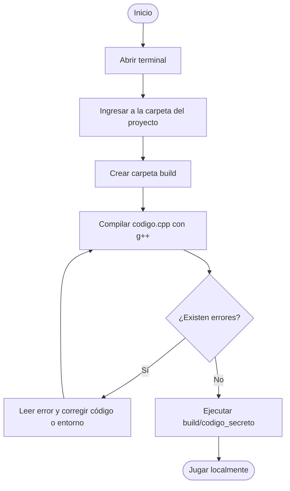

# Desplegar Código Secreto localmente

## 1. Objetivo

Esta guía explica cómo compilar y ejecutar el proyecto `Código Secreto` en una computadora local.

El proyecto es una aplicación de consola escrita en C++. No necesita instalar bibliotecas externas porque utiliza únicamente `<iostream>`.

## 2. Archivos necesarios

La compilación utiliza un solo archivo:

```text
codigo.cpp
```

Todas las funciones del juego están implementadas dentro de `codigo.cpp`.

## 3. Requisitos

Se necesita un compilador compatible con C++17.

Para comprobar si `g++` está instalado:

```bash
g++ --version
```

Si el comando muestra la versión del compilador, se puede continuar con la compilación.

## 4. Abrir la carpeta del proyecto

En una terminal, ingresar a la carpeta:

```bash
cd /home/cszv/Documents/UCB-LIA/sis111/assignments/final_project
```

Si el proyecto se encuentra en otra ubicación, reemplazar la ruta por la carpeta correspondiente.

## 5. Crear la carpeta de compilación

Crear una carpeta separada para el ejecutable:

```bash
mkdir -p build
```

La carpeta `build/` evita mezclar el archivo compilado con el código fuente. También está incluida en `.gitignore`, por lo que Git no debe versionarla.

## 6. Compilar

Ejecutar:

```bash
g++ -std=c++17 -Wall -Wextra -pedantic codigo.cpp -o build/codigo_secreto
```

### Significado del comando

| Parte | Propósito |
| :--- | :--- |
| `g++` | Ejecuta el compilador de C++. |
| `-std=c++17` | Utiliza el estándar C++17. |
| `-Wall` | Activa advertencias comunes. |
| `-Wextra` | Activa advertencias adicionales. |
| `-pedantic` | Comprueba el cumplimiento estricto del estándar. |
| `codigo.cpp` | Indica el único archivo fuente que se debe compilar. |
| `-o build/codigo_secreto` | Guarda el ejecutable dentro de `build/`. |

Si la compilación termina sin mensajes de error, el ejecutable fue creado correctamente.

## 7. Ejecutar el juego

Ejecutar:

```bash
./build/codigo_secreto
```

Debe aparecer:

```text
=== CODIGO SECRETO ===
1. Jugar
2. Ver instrucciones
3. Salir
Seleccione una opcion:
```

## 8. Compilar y ejecutar nuevamente

Después de modificar `codigo.cpp`, volver a compilar antes de ejecutar:

```bash
g++ -std=c++17 -Wall -Wextra -pedantic codigo.cpp -o build/codigo_secreto
./build/codigo_secreto
```

## 9. Prueba rápida

Para comprobar automáticamente que el programa inicia y permite salir:

```bash
printf '3\n' | ./build/codigo_secreto
```

El programa debe mostrar el menú y terminar sin errores.

## 10. Errores frecuentes

### `g++: command not found`

El compilador no está instalado o no está disponible en la terminal.

En Ubuntu o Debian:

```bash
sudo apt update
sudo apt install g++
```

### `No such file or directory`

La terminal probablemente no se encuentra dentro de la carpeta del proyecto.

Comprobar la ubicación actual:

```bash
pwd
```

Después ingresar nuevamente a la carpeta correcta con `cd`.

### Error al ejecutar `./build/codigo_secreto`

Primero confirmar que la compilación terminó correctamente y que el archivo existe:

```bash
ls -l build/codigo_secreto
```

### Se modificó el código, pero el comportamiento no cambia

El ejecutable todavía corresponde a una compilación anterior. Volver a ejecutar el comando de compilación antes de iniciar el juego.

## 11. Flujo resumido



## 12. Comandos mínimos

```bash
cd /home/cszv/Documents/UCB-LIA/sis111/assignments/final_project
mkdir -p build
g++ -std=c++17 -Wall -Wextra -pedantic codigo.cpp -o build/codigo_secreto
./build/codigo_secreto
```
