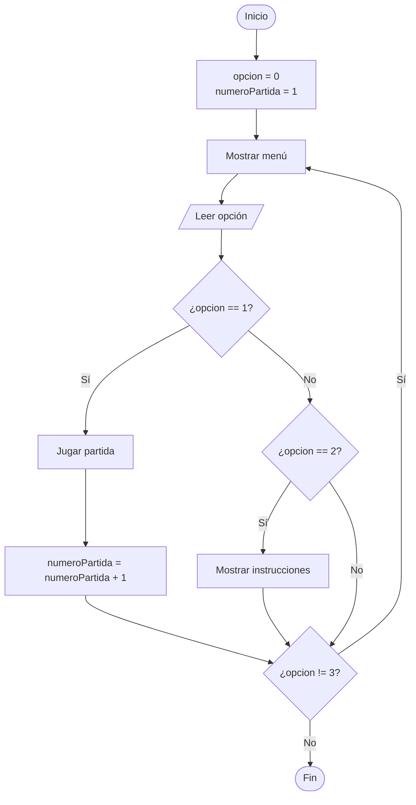
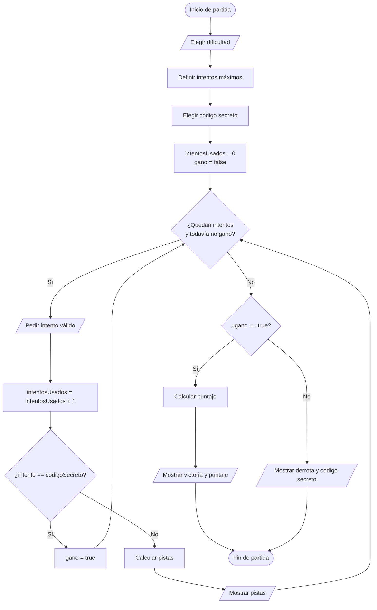
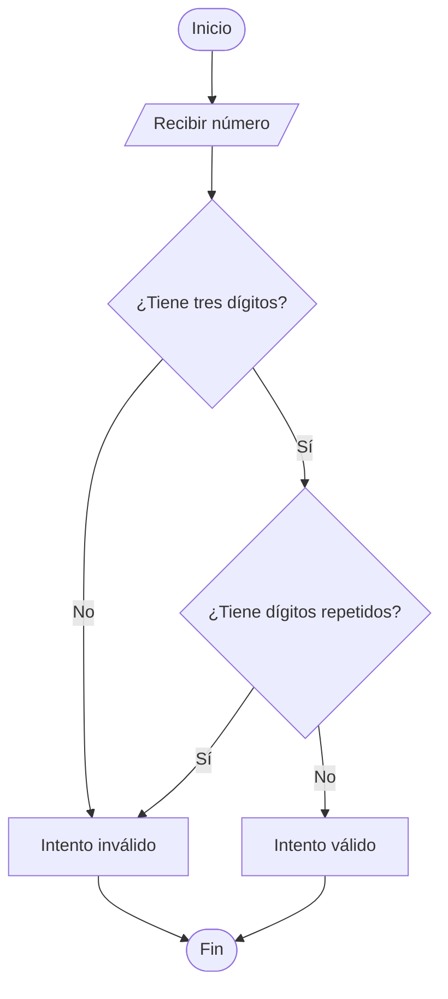
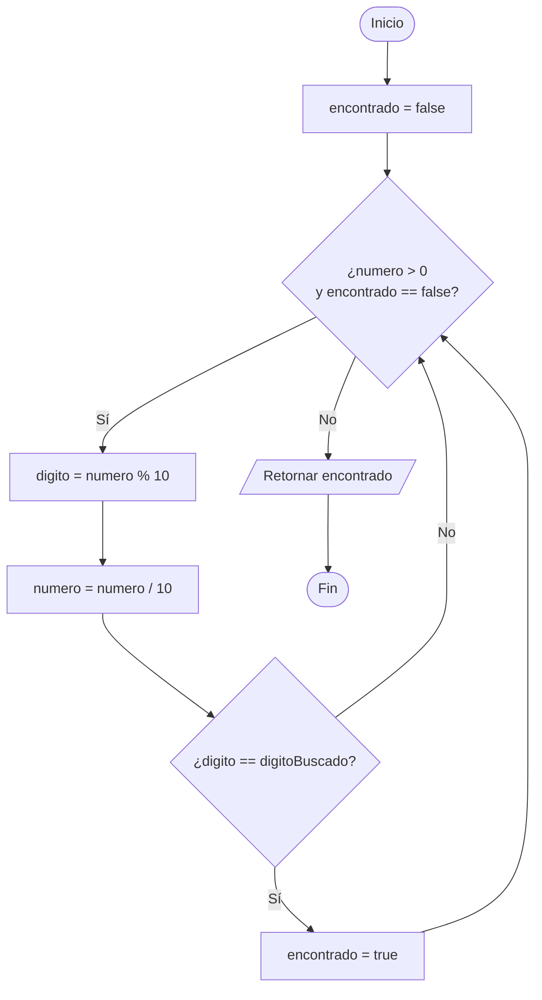
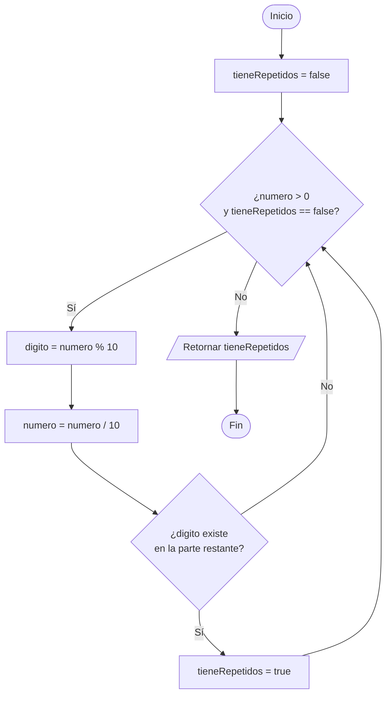
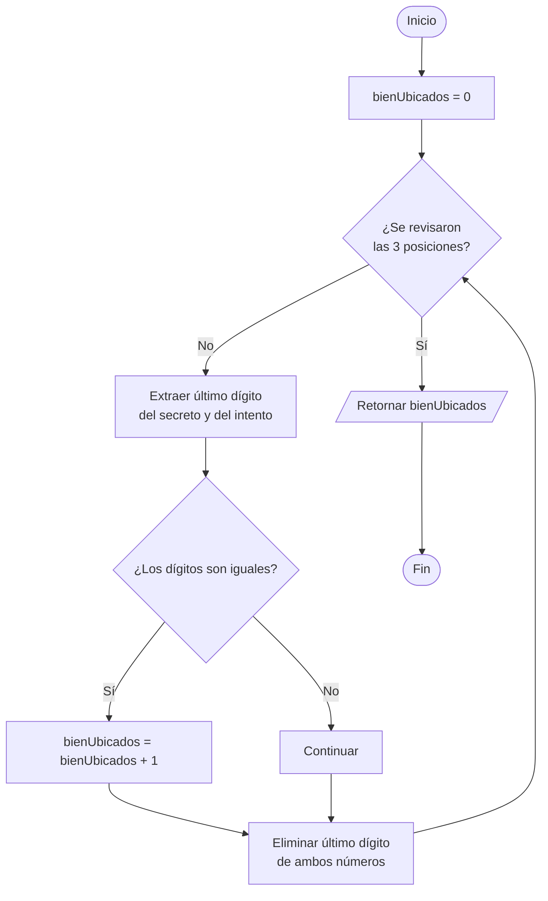
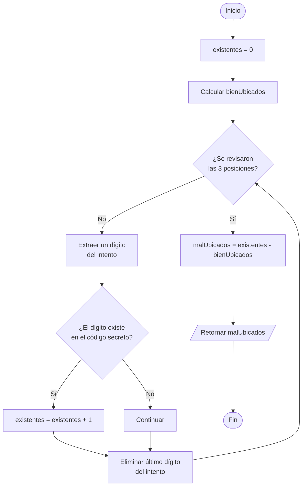

# Diagramas de flujo

## 1. Simbología usada

| Forma | Uso |
| :--- | :--- |
| Óvalo | Inicio o fin. |
| Paralelogramo | Entrada o salida de datos. |
| Rectángulo | Proceso o asignación. |
| Rombo | Pregunta con resultado verdadero o falso. |

## 2. Flujo general del juego

## 3. Flujo de una partida

## 4. Validar un intento

## 5. Buscar un dígito dentro de un número

## 6. Detectar dígitos repetidos

## 7. Contar dígitos bien ubicados

## 8. Contar dígitos mal ubicados

## 9. Cómo explicar los diagramas

No describas únicamente las flechas. Usa esta estructura:

1. Qué dato entra.
2. Qué variable se inicializa.
3. Qué pregunta controla el ciclo.
4. Qué cambia dentro del ciclo.
5. Cuándo termina.
6. Qué resultado retorna o muestra.
