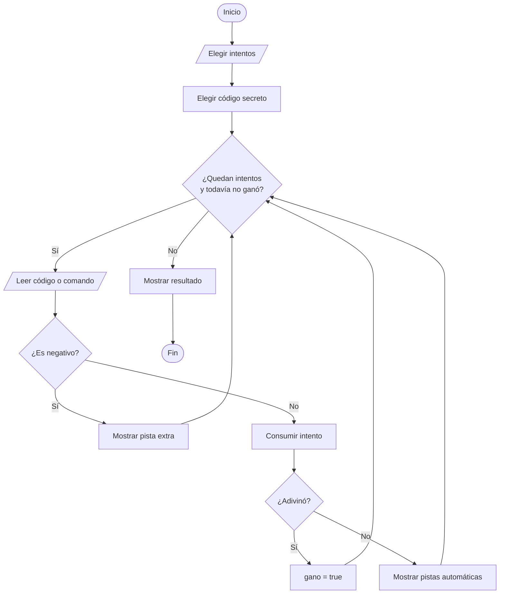

# Diagramas de flujo

## Partida

```mermaid
flowchart TD
    A([Inicio]) --> B[/Elegir intentos/]
    B --> C[Elegir código secreto]
    C --> D{¿Quedan intentos<br/>y todavía no ganó?}
    D -- No --> K[Mostrar resultado]
    D -- Sí --> E[/Leer código o comando/]
    E --> F{¿Es negativo?}
    F -- Sí --> G[Mostrar pista extra]
    G --> D
    F -- No --> H[Consumir intento]
    H --> I{¿Adivinó?}
    I -- Sí --> J[gano = true]
    I -- No --> L[Mostrar pistas automáticas]
    J --> D
    L --> D
    K --> M([Fin])
```

## Recorrer dígitos

```mermaid
flowchart TD
    A([Inicio]) --> B{¿numero > 0?}
    B -- Sí --> C[digito = numero % 10]
    C --> D[numero = numero / 10]
    D --> E[Procesar dígito]
    E --> B
    B -- No --> F([Fin])
```
