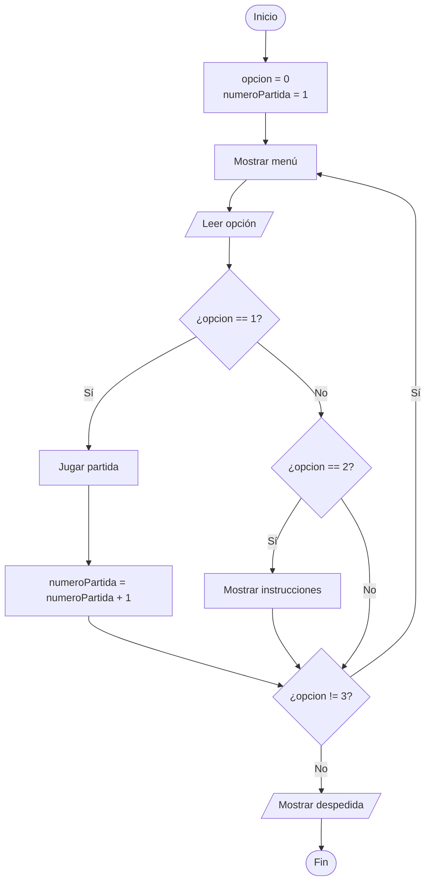
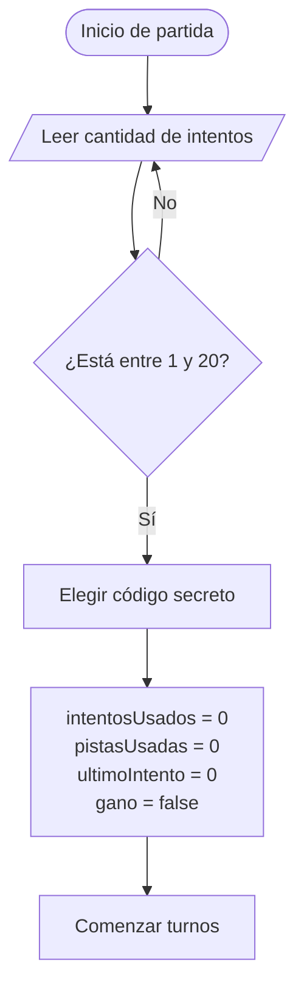
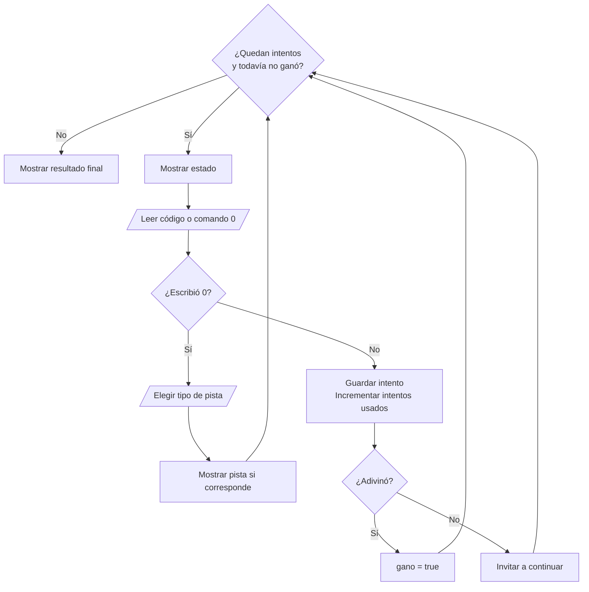
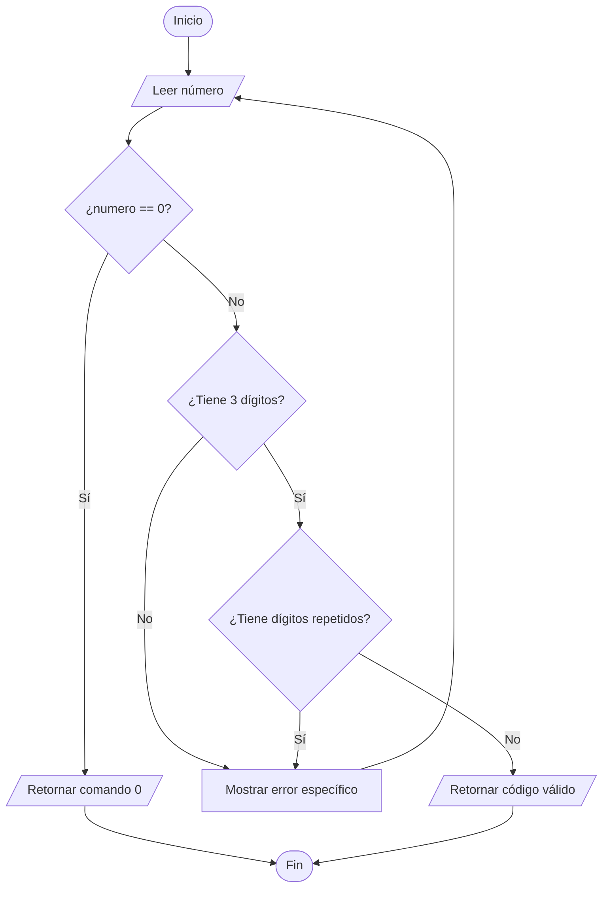
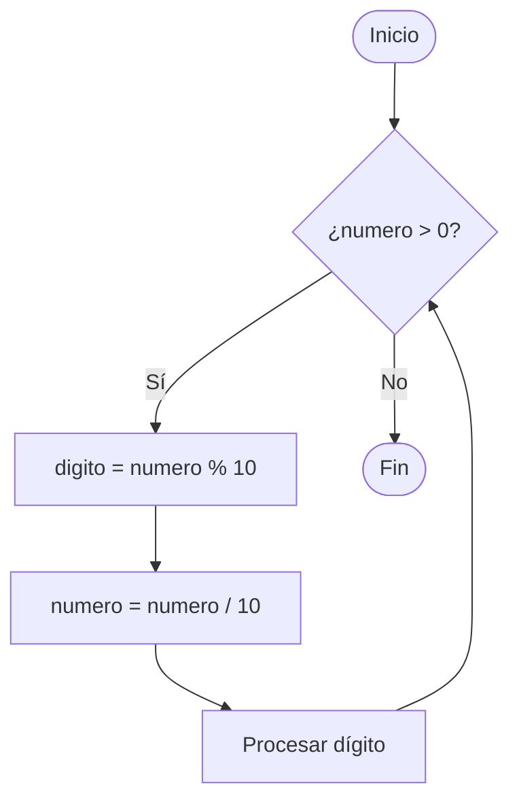
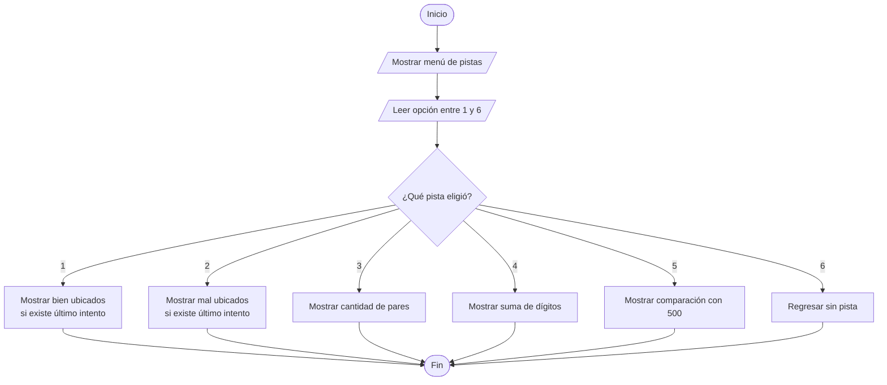

# Diagramas de flujo

## 1. Flujo principal

## 2. Configurar e iniciar partida

## 3. Turno de juego

## 4. Validar código o comando

## 5. Recorrer dígitos

## 6. Solicitar pista

## 7. Cómo explicar un diagrama

1. Identificar el dato de entrada.
2. Explicar qué variable se inicializa.
3. Leer cada pregunta como verdadero o falso.
4. Indicar qué cambia en cada vuelta.
5. Explicar cuándo termina.
