# Flowchart de `codigo.cpp`

Este archivo explica el flujo del programa con diagramas Mermaid.

La idea principal es esta:

1. El `main` muestra el menu principal.
2. Si el jugador elige jugar, entra a `jugar`.
3. En cada turno puede probar un codigo, pedir ayuda o rendirse.
4. Si descubre el codigo secreto, pasa al desafio final.
5. Al terminar, el programa muestra resultado y puntaje.

## 1. Vista general

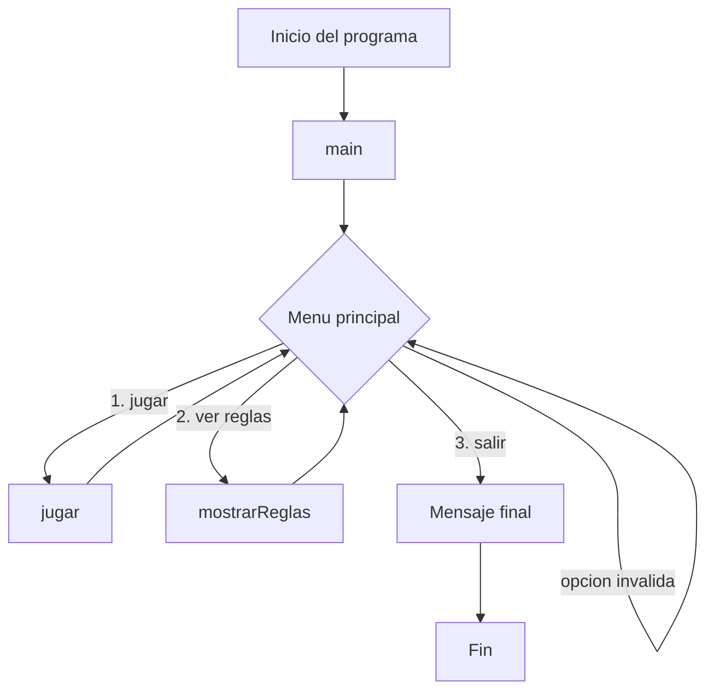

## 2. Menu principal

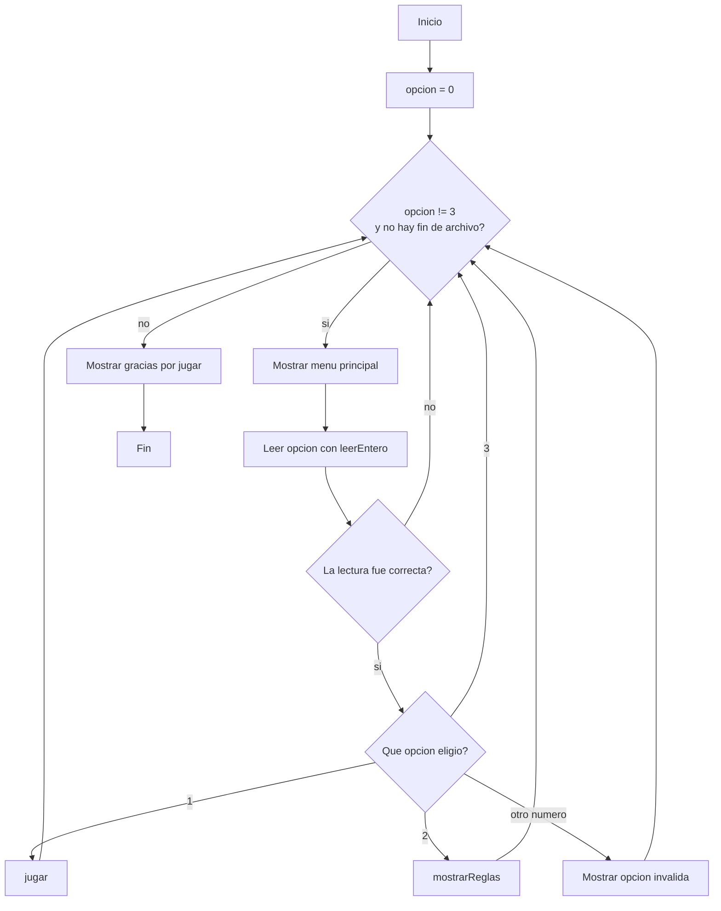

## 3. Partida completa

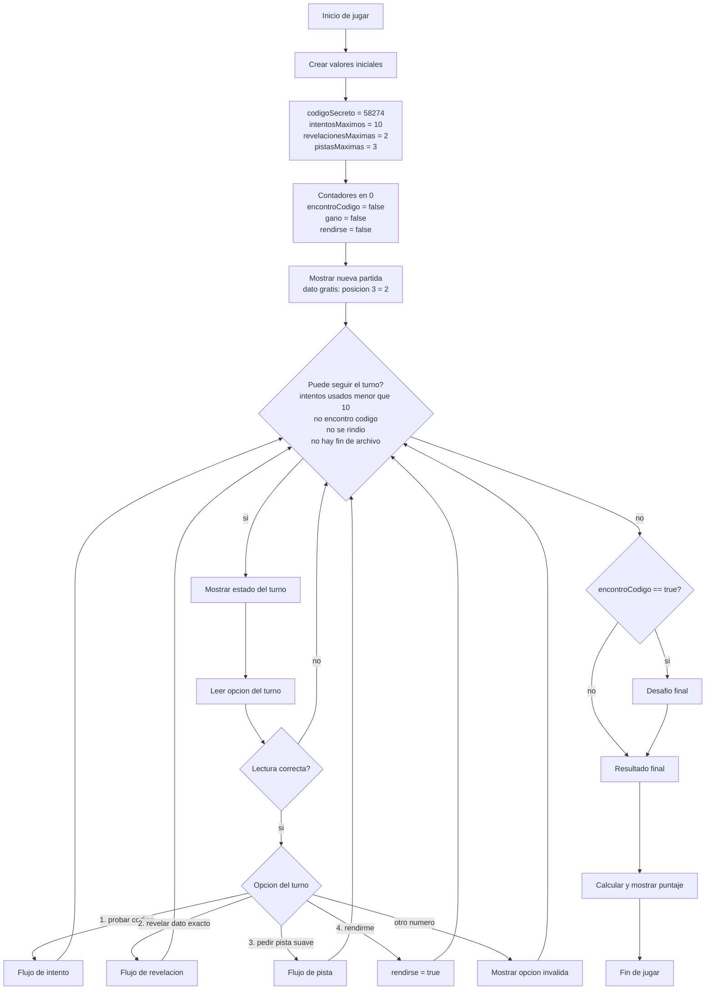

## 4. Probar codigo

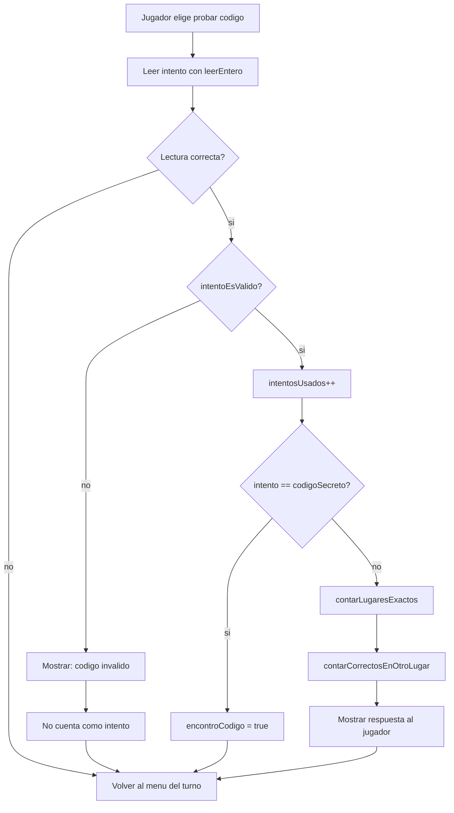

## 5. Validar intento

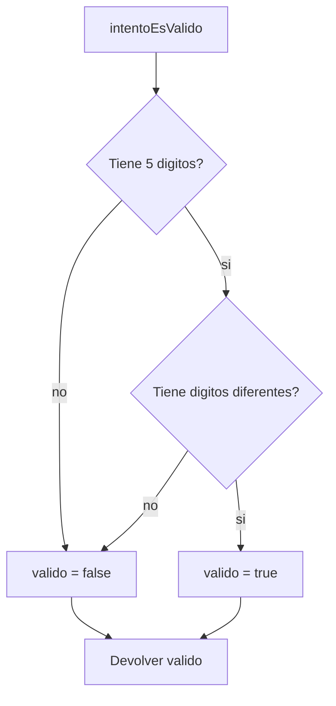

## 6. Contar respuesta del intento

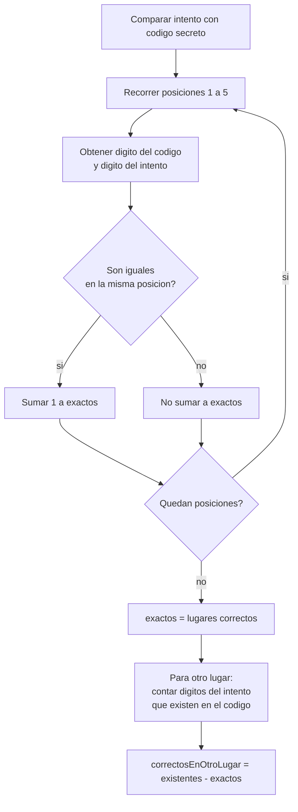

## 7. Ayudas de la partida

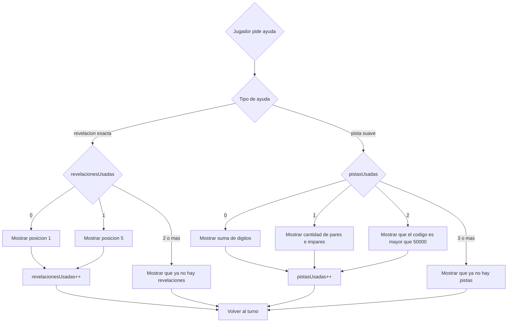

## 8. Desafio final

El desafio final solo aparece si el jugador ya encontro el codigo secreto.

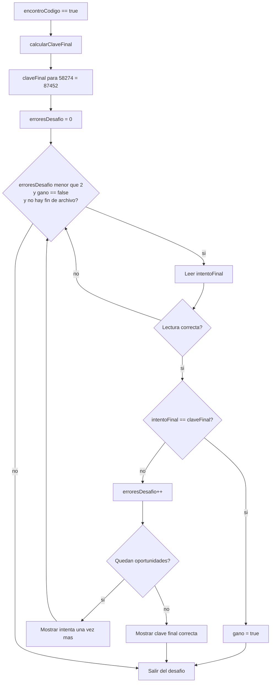

## 9. Calcular clave final

La clave final se arma alternando:

1. Mayor digito par disponible.
2. Mayor digito impar disponible.
3. Siguiente par disponible.
4. Siguiente impar disponible.

Para el codigo `58274`, la clave queda `87452`.

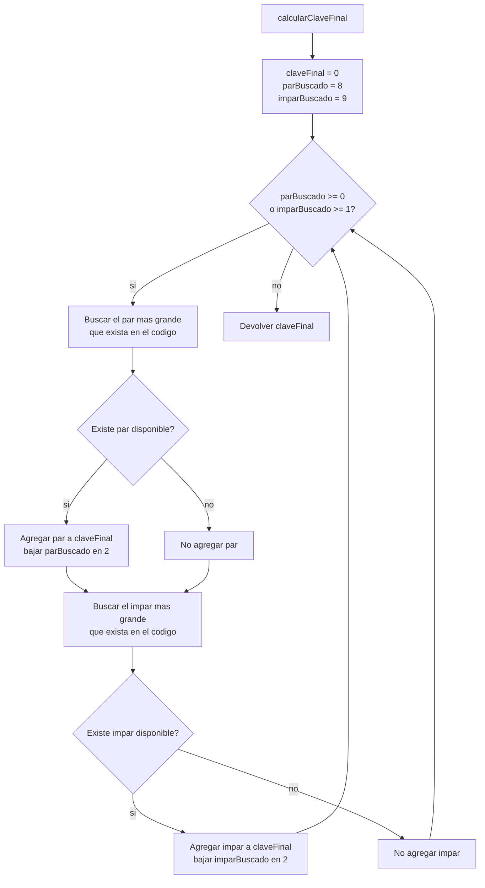

## 10. Resultado y puntaje

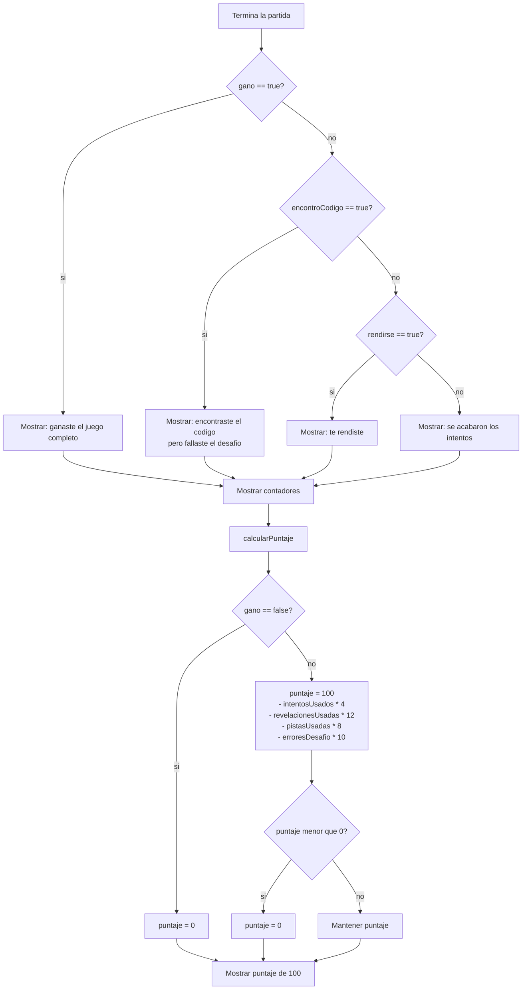

## 11. Relacion entre funciones

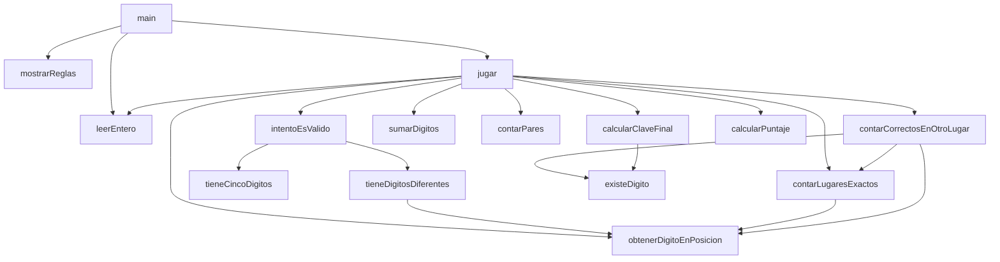
